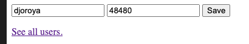
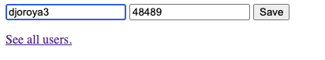

Se ha desarrollado una API-REST en el framework flask que guarda nombres de usuario, codigo postal y la ciudad del usuario. En concreto la ciudad de usuario es tomado del servicio geonames. Este servicio es capaz de retornar varias propiedades dad un código postal, se ha escogido la propiedad "community_name" del código postal. Esta hace referencia a un nombre único para cada codigo postal. 

## Ficheros 
- ConnectDB.py: Funciones para guardar y consultar en los usuario, asi como la consulta de la base de datos de nombres de ciudad.
    - class "user"
    - function communications: Toma las variables (UserName,PC) y guarda en la base de datos (si no existe ya) un nuevo usuario. 
        * Retorna el codigo 0 si todo ha ido bien.
        * Retorna el codigo 1 no se ha podido grabar el usuario porque el codigo postal esta mal.
        * eRetorna l codigo 2 si el usuario ya existe.
- app.py: API REST en flask que utiliza la función "communications" para 
- datasets/db_users_details.json: Fichero json que remplaza a una base de datos de detalles de usuario.
- datasets/db_users.json: Fichero json que remplaza a una base de datos de usuario.
- test.py: Ejemplo de utilización de las funciones definidas en ConnectDB.py

# Setup

Instalación en la consola
```
pip install pgeocode
pip install jsons
pip install flask
```

## API REST  

```
python3 app.py
```

```
 * Serving Flask app "app" (lazy loading)
 * Environment: production
   WARNING: This is a development server. Do not use it in a production deployment.
   Use a production WSGI server instead.
 * Debug mode: on
 * Running on http://127.0.0.1:4000/ (Press CTRL+C to quit)
 * Restarting with stat
 * Debugger is active!
 * Debugger PIN: 204-892-608
```

Se deberá aceder por la un navegador a http://127.0.0.1:4000/. Se verá un formulario donde se pueden agregar los usuarios. 

## Ejemplos 



```
{
  "error_code": "0", 
  "messaje": "received and save!"
}
```


```
{
  "error_code": "1", 
  "message": "The post code doesnt exist"
}
```


```
{
  "error_code": "2", 
  "message": "The User already exist"
}
```


